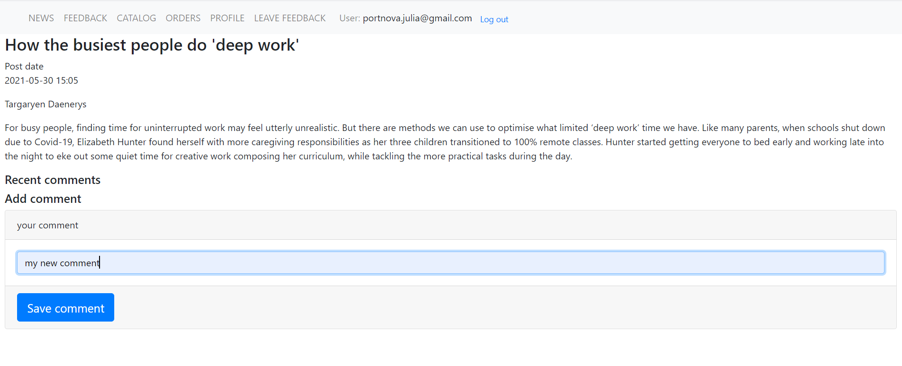
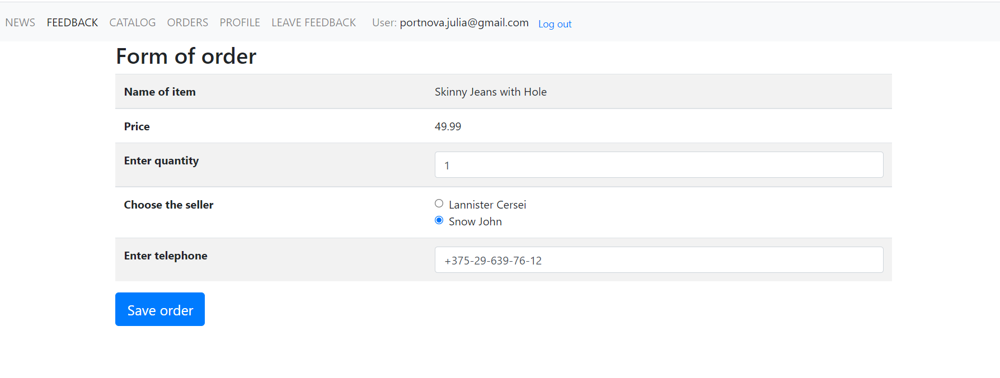

# Final project "BuyTut" 
The project was carried out as a final part of IT Academy course "Technologies for the development of enterprise solutions in Java".
This is a site - emulation of a marketplace - for users with 4 roles.

## Table of Contents
* [General Info](#general_information)
* [Technologies Used](#technologies-used)
* [Features](#features)
* [Screenshots](#screenshots)
* [Setup](#setup)
* [Project Status](#project-status)
* [Room for Improvement](#room-for-improvement)
* [Acknowledgements](#acknowledgements)
* [Contact](#contact)

## General Information
The purposes of project were:
* to prepare myself for work in real projects;
* to show the ability to apply the theoretical knowledge of the tools and technologies of development of web applications.

## Technologies Used

* Java - version 11;
* Maven - version 3.6.3;
* Spring Boot - version 2.4.2;
* Spring Security;
* Spring Data JPA;
* Thymeleaf;
* Thymeleaf extras Spring Security5;
* Spring Boot DevTools;
* Spring Web;
* Spring Mail;
* Spring Security Test;
* MySQL Testcontainers - version 1.15.3;
* Liquibase - version 3.10.3;
* Lombok - version 1.18.16;

## Features

The features of project are described in the terms of reference:

* [JD2. TR Part1 ](https://docs.google.com/document/d/1JOl8YzoVO5F9nDtwRAGi783N1AkX0grGOCUdpQJEEd0/edit)

* [JD2. TR Part2 ](https://docs.google.com/document/d/1aZZj4n_n7VSAvdj5TEqmpNLh3FBluiK4sAVDYIupFGU/edit)

* [JD2. TR Part3 ](https://docs.google.com/document/d/1tq1EdRuLqxDm2tDY-H3jbHMK6hvRnBuSuoAvjBuy6k0/edit)

* [JD2. TR Part4](https://docs.google.com/document/d/1O6QIkMxKkeEzenqHx1xL5NSObd79XRnuiHc88F1-SWI/edit)

Besides that, I've included some additional functionality:
* user with role CUSTOMER USER can add comments to the article;
* the unique number of the item is generated depending on the item group;
* users with role SALE USER can delete or copy item only in their own catalogs , as well as to delete or update only their own articles;
* user with role SECURE REST API can delete any item in any catalog and to delete any article; 

## Screenshots

## Setup

This project is a Spring Boot application built using Maven.
To try it out first clone the git repository:

    git clone git://https://github.com/julia-jpl/final-project-course-jd2/tree/develop

You should install Maven and then in the final-project-course-jd2 directory  run the Maven build for the project:

    mvn clean package

To connect to database you should create and run Docker container with the following configuration:
Bind ports 3306:3306;
image tag: mysql;
container name: mysql;
environment variables: MYSQL_ROOT_PASSWORD=1234; MYSQL_DATABASE=jd2_final_project

Then run the application

    java -jar target/*.jar

and visit in your browser:

    http://localhost:8080/login

Now you can work with the application.
Credentials for users with different roles are following:
* ADMINISTRATOR - username: admin@myhost.com, password: 1234;
* CUSTOMER USER - username: portnova.julia@gmail.com, password: 12345;
* SALE USER - username: sale@myhost.com, password: 0987;
* SECURE REST API (Basic authentication) - username: rest@myhot.com, password: qwer.

## Project Status
Project completed.

## Room for Improvement
According to the needs of the potential customer some features can be added, for example:
* work with the storage of items;
* workflow for order status: to describe how it can be changed.

## Acknowledgements
Many thanks to...
* our tutor Artsiom Peravoznikau for patience and ability to share his knowledge and professional experience;
* my groupmates for a creative and competitive atmosphere during the process of our training;
* myself for being such a smart girl:-), being able to complete this project and ready for new ones! 

## Contact
Created by portnova.julia@gmail.com. Feel free to contact me!

 

